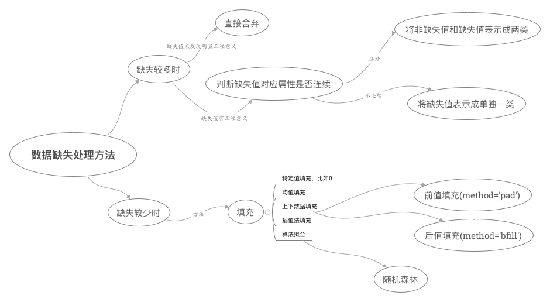

# 机器学习中数据缺失和异常的处理方法汇总

- [数据缺失的处理方法](#数据缺失的处理方法)

- [数据异常的处理方法](#数据异常的处理方法)

#### 数据缺失的处理方法
数据缺失的处理，一般要根据缺失数据的多少以及实际应用的场景来区别对待，具体如下：  

#### 数据异常的处理方法
对于异常值的判断内容如下：  
- 对于类别型变量（Category）来说，如果某个类别值出现的频率太小，太稀有，就可能是异常值。具体拿经验值来参考，一般某个类别值的分布占比不到1%或者更少就很可能是异常值了。当然，这还需要数据分析师根据具体项目的业务背景和数据实际分布作出判断和进行权衡。有些情况下，纵然某个类别值的占比很少，但是如果跟目标变量里的目标事件有显著的正相关关系，这种稀有类别值的价值就不是简单的异常值所可以代表的。

- 对于区间型变量（Interval）来说，最简单有效的方法就是把所有的观察对象按照变量的取值按从小到大的顺序进行排列，然后从最大的数值开始倒推0.1%甚至更多的观察值，这些最大的数值就很可能属于异常值，可再结合业务逻辑加以判断。另外一个常用的判断异常值的方法就是以“标准差”作为衡量的尺度，根据不同的业务背景和变量的业务含义，把超过均值n个标准差以上的取值定义为异常值，这里n的取值范围取决于具体的业务场景和不同变量的合理分布，比如超过均值在正负4个标准差以上的数值就要认真评估，确定其是否是异常值。

对于异常数据，处理方法一般都是直接删除
